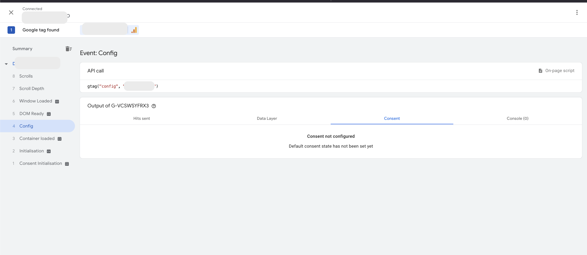
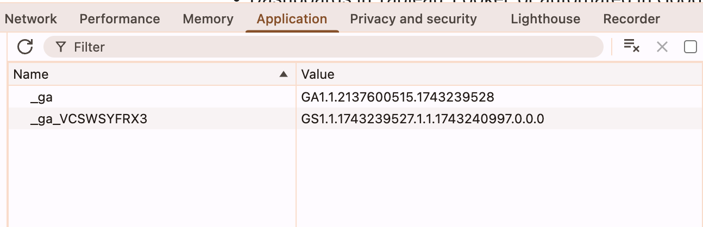
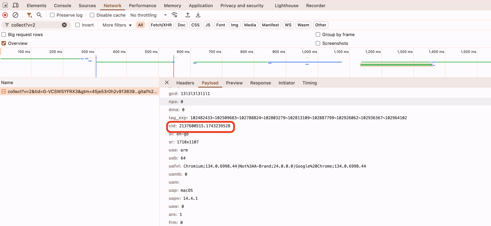
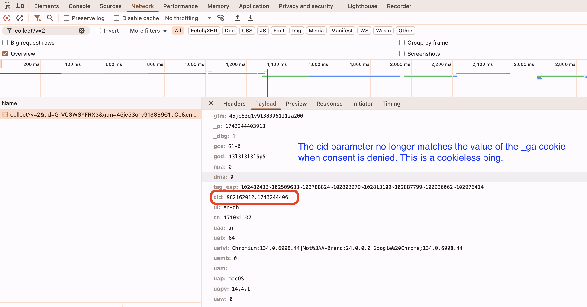

# Cookie Consent, Google Analytics and Attribution

What happens if you don’t configure a consent state for a Google Analytics (GA) tag? By default, GA processes the data as if consent were granted. Data is not impacted, though this default behavior may change in the future. <!-- more -->

## Basic and Advanced Consent Mode

[How Consent Mode Works](https://support.google.com/google-ads/answer/10000067) documentation covers basic and advanced consent mode.

With basic consent mode, tags are blocked until consent is granted, so overall traffic volume may decrease. However, the attribution data distribution (e.g., Direct, Organic, or Paid Search) stays intact.

Setting up [Advanced Consent Mode](https://support.google.com/google-ads/answer/10000067) allows Google tags to fire before consent acceptance using cookieless pings. Using these pings lets GA get a closer-to-complete view of all web traffic than otherwise.

This is done via modeling and the use of [url_passthrough](https://developers.google.com/tag-platform/security/guides/consent?consentmode=advanced#passthroughs), where UTMs follow the user around from page to page till acceptance of cookies, at which point a session is initiated with the UTMs on consent update.

In both cases you should still update consent state on acceptance to facilitate GA modeling quality and future proof your setup.

## Cookieless Pings

Without cookies, GA is not able to measure individual users or sessions. Cookieless events are fired as if standalone, detached from any session or user. GA uses modeling to try to fill in the gaps, provided thresholds in volume are met.

Google Analytics uses a cookie `_ga` to identify a user (browser) and this cookie value gets sent in regular hits.

To see what a cookieless ping looks like, I overrode default GTAG consents to "denied", implying an advanced consent mode set up, and then compared two page_view hits in the console.

When consent has been granted, or not configured (and thus assumed granted and using basic consent mode), the value of this cookie is sent with the hit in the `cid` parameter (client id). Note that, aside from the prefix "GA1.1.", the values match in the two screens below. The `_ga` cookie value is sent in the `cid` parameter of the ping:

But when consent has been denied, the hit is still sent, but with a random `cid`. The hit below was sent from the same browser where the value of cookie `_ga` was still `GA1.1.2137600515.1743239528`, however the `cid` parameter was a random value.

It's a cookieless ping:

