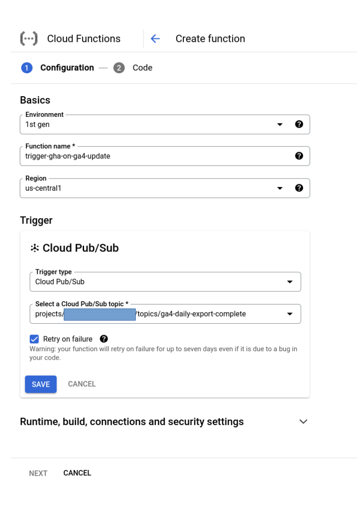
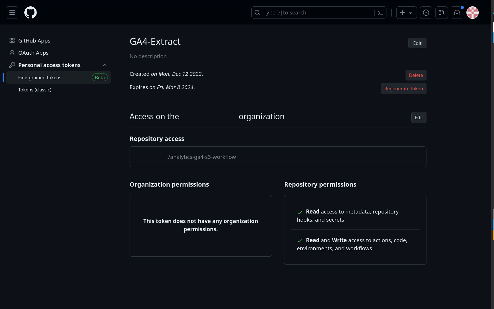
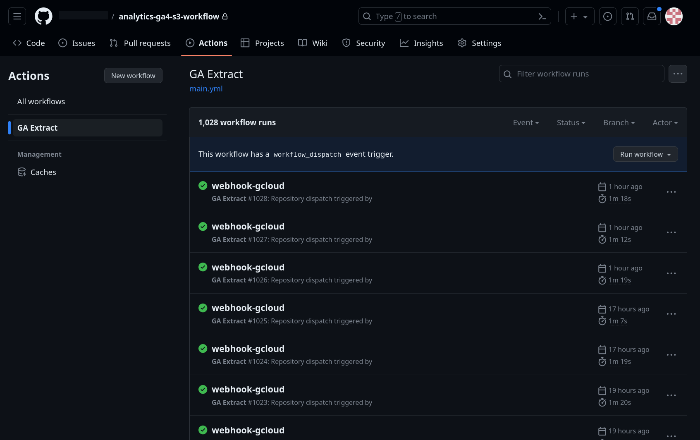

# Extract Google Analytics Data to AWS (Via Big Query)

## Summary

GA4 provides a convenient point and click extract into Big Query. On several occassions I've been asked to forward this extract to AWS. <!-- more --> GA4 data in the Big Query extract are retained for a rolling 60 days. [Details](https://support.google.com/analytics/answer/9358801?hl=en).

> You can export to a free instance of BigQuery [(BigQuery sandbox)](https://cloud.google.com/bigquery/docs/sandbox), but exports that exceed the sandbox limits incur charges

The Big Query extract is useful because all GA4 data are already neatly packaged up into an event fact table. If using the API directly you would need to wrestle with limits and restrictions on dimension and metric combinations. 

[GA4 Big Query Export Documentation](https://support.google.com/analytics/answer/9358801?hl=en)

With the Big Query extract up and running, you might want to get your GA4 data into AWS, Azure or anywhere else.

The gist of this post is exporting GA4 data into Google Storage (GS) whenever extract data are updated, then [`Rsync`ing](https://cloud.google.com/storage/docs/gsutil/commands/rsync) between GS and AWS S3.

"whenever extract data are updated". This part [Draws heavily from Simo's Simmer post "How Do I Trigger A Scheduled Query When The GA4 Daily Export Happens"](https://www.teamsimmer.com/2022/12/07/how-do-i-trigger-a-scheduled-query-when-the-ga4-daily-export-happens/)

GA4 data are extracted at inconsistent times and daily tables can be updated up to 72 hours or longer after the date of the table (See linked documentation above for details).

I used Github Actions (GHA) with this workflow but you could keep it all in a cloud function if you prefer. I chose Github Actions here because:
 * In addition to running the AWS extract automatically on each update, you can also back fill over a custom date range using user input fields in the Actions tab of your repo. The actions tab is a convenient UI.
 * The GHA community actions and marketplace make it very easy and convenient to use additional tools in your workflow, in this case the Google Cloud cli. The AWS cli is already pre-installed on the runners.
 * You might want to trigger other workflows after GA4 data have been ingested, such as running some DBT models.

Approach:
1. (Google Cloud) Create a Pub/Sub topic using the Logs Router which listens for GA4 daily extract updates and is used to trigger a cloud function and pass details to the function, including the extract event date for the data.
2. (Google Cloud) Use a Cloud Function to trigger a workflow in Github Actions using a webhook.
3. (Github Actions) Extract the table's event data into Google Storage using the Google Cloud CLI.
4. (Github Actions) Rsync data from Google Storage to AWS S3

Once data are in S3 you can then populate a table in your preferred SQL engine, such as Redshift or Athena. The Big Query extract contains structured data, just create an equivalent table with like field data types to those of [the Big Query one](https://support.google.com/analytics/answer/7029846?hl=en). Or, if using Redshift, copy / paste the `create table` sql below.

## Inputs Needed to Follow this Post

* A Github repo along with a fine grained access token (details below). This repo is used to run an actions workflow that moves GA4 data from BQ to AWS. Ensure the repo has actions enabled.
* GA4 daily extract to Big Query is up and running. When you first set this up it will take 1-2 days before data start coming in. [Documentation](https://support.google.com/analytics/answer/9823238).
* Json for a Google service account to allow Github Actions to access GA4 data on Google Cloud and to temporarily move it to Google Storage
* AWS S3 credentials for a bucket to send the data to, including `AWS_S3_BUCKET`, `AWS_ACCESS_KEY_ID`, `AWS_SECRET_ACCESS_KEY`, `AWS_DEFAULT_REGION`.
* A Google Storage bucket to save the data in before sending to AWS S3.

## Create a Pub / Sub Topic in Google Cloud

In short, we want to create a pub / sub topic using the [Logs Router](https://console.cloud.google.com/logs/router) in Google Cloud. This will allow us to trigger a Cloud Function when GA4 data are extracted into BQ.

As mentioned above, I drew on [the article by Simo at Simmer](https://www.teamsimmer.com/2022/12/07/how-do-i-trigger-a-scheduled-query-when-the-ga4-daily-export-happens/) to complete this step. See the link for more details, especially on how to filter logs for GA4 extract updates under the section "2. Create the Logs Router".

## Use a Cloud Function to Trigger a Github Actions Workflow

Once the Pub / Sub sink has been created per the previous step, create a [Cloud Function](https://console.cloud.google.com/functions/list) and for the trigger choose Pub / Sub and select the topic from the previous step.

How mine looks:

 
Configure the following environment variables with your function:
 
  * `OWNER`: The repo owner of the repo where the workflow will be triggered. github.com/\<owner\>/\<repo name\>
  * `REPO`: The repo name github.com/\<owner\>/\<repo name\>
  * `EVENT_TYPE`: I used 'webhook-gcloud' so that when the actions workflow runs, it will show as this type of trigger.
  * `DB_SCHEMA`: This will be the eventual S3 bucket path e.g 'dev' while testing then 'production' when up and running.

Over in Github, create a personal access token and store it in Google Cloud as a secret called `PAT`. This should be a Github access token which has permission to read and write to the repo. Go to [developer settings](https://github.com/settings/personal-access-tokens) in Github and create a new fine grained access token and give it appropriate permissions.


 
Back in Google Cloud, your cloud function variables tab should look similar to this:


Next we need a function to tell the Github Actions workflow that new data are available for a specific date. The `DATE_PART` comes from the event data that comes with the pub / sub topic trigger. You can paste code directly into a cloud function or sync with a repo. I used the following Python for the function.

```
# Triggers a github actions workflow using an api request
# Test via the functions testing tab in GCP functions UI

import requests
import os
import base64
import json
from datetime import datetime

OWNER = os.environ['OWNER']
REPO = os.environ['REPO']
EVENT_TYPE = os.environ['EVENT_TYPE']
PAT = os.environ['PAT']
DB_SCHEMA = os.environ['DB_SCHEMA'] # will be a path in the S3 bucket
DATE_PART = '2022-12-01' # default for testing, will be overwritten within funcs

# funcs
## api request
def requestGHA(DATE_PART, PAT=PAT, OWNER=OWNER, REPO=REPO, EVENT_TYPE=EVENT_TYPE):

    # Set up the headers for the API request
    headers = {
        "Accept": "application/vnd.github+json",
        "Authorization": f"Bearer {PAT}",
    }

    # Set up the URL for the API request
    url = f"https://api.github.com/repos/{OWNER}/{REPO}/dispatches"

    # Set up the payload for the API request
    payload = {
        "event_type": EVENT_TYPE,
        "client_payload": {
            "start_date": DATE_PART,
            "end_date": DATE_PART,
            "db_schema": DB_SCHEMA
        }
    }

    # Make the API request
    response = requests.post(url, json=payload, headers=headers)

    # Print the response status code
    return(str(response.status_code))
    
def callRequest(event, context): # on cloud pub sub event will trigger with these 2 args
    
    global DATE_PART
    
    # if the function is called from the pub/sub trigger get the date, otherwise during testing use the default DATE_PART from globals above
    if 'data' in event:
        
        event_data = base64.b64decode(event['data']).decode('utf-8')
        event_data = json.loads(event_data) # turn from a string to a dict
        destination_table_id = event_data['protoPayload']['serviceData']['jobCompletedEvent']['job']['jobConfiguration']['load']['destinationTable']['tableId']
        print("destination_table_id")
        print(destination_table_id)
        
        DATE_PART = destination_table_id.split('_')[1]
        DATE_PART = datetime.strptime(DATE_PART, '%Y%m%d')
        DATE_PART = DATE_PART.strftime('%Y-%m-%d')
        
    print("--- here is date part ---")
    print(DATE_PART)
    
    st = requestGHA(DATE_PART=DATE_PART)
    return(st)
```

You can test the function in the GCP UI, you should get a 'OK' message like in the image below. Later, once we create an actions workflow file in your repo, you will be able to see the 'webhook-gcloud' event trigger in the repo actions tab.

The function pings your repo via an http request and sends the event date along with it. This will be used in the workflow to extract data from Big Query and to then send along to AWS S3 via Google Storage.


Once Github Actions are set up and authorization is done (steps are further down), you should also see a screen within Github Actions like this when testing the workflow:


## Rsync data between Google Storage and S3

The workflow file in this example should be stored in your repo at `.github/workflows/main.yml`.

First set some repo secrets:

 * `AWS_SECRET_ACCESS_KEY`
 * `AWS_ACCESS_KEY_ID`
 * `AWS_S3_BUCKET` The name of the bucket where you will store the extracted data
 * `GS_BUCKET` The name of the Google Storage bucket that will be used to save the Big Query data before Rsync. Example form `gs://ga4-extract-bigquery`
 * `SERVICE_JSON` The service account json that will be used to authorize the gcloud cli and access both Big Query and Google Storage. Ensure appropriate permissions.
 * `GCP_PROJECT` The name of the Google Cloud project where you extract your GA4 data to

Then, define some variables from the incoming http request, namely the table date of the data to be extracted.

```
name: GA Extract

on:
  workflow_dispatch:
    inputs:
      start_date:
        required: true
        type: string
        default: '2022-12-01'
      end_date:
        required: true
        type: string
        default: '2022-12-01'
      db_schema:
        required: true
        type: string
        default: 'dev'  
  repository_dispatch:
    types: [webhook-gcloud] 

env:
  DB_SCHEMA: ${{ github.event.client_payload.db_schema || inputs.db_schema }}
  START_DATE: ${{ github.event.client_payload.start_date || inputs.start_date }}
  END_DATE: ${{ github.event.client_payload.end_date || inputs.end_date }}
```

The workflow dispatch trigger is for the when the workflow is run manually via the actions UI. 

When the workflow is triggered via the Google cloud function, variables `start_date`, `end_date` and `db_schema` are taken from the http request payload from the python via Google cloud above and set as env vars for the workflow. A trigger is set up for API requests using `repository_dispatch` where the type matches what we set in the cloud functions env vars `webhook-gcloud`.

In case the workflow is run manually while developing or if back filling, `start_date` and `end_date` and `db_schema` are set using variable expansion (`FOO = this || that`).

Now that the environment is set, define the job then checkout and authorize Google's gcloud actions container:

```
jobs:
  get-bq-data:
    runs-on: ubuntu-22.04
    name: BQ-GS-S3
    steps:
      - name: Checkout current repo
        uses: actions/checkout@v2 # Defaults to current repo
      - name: Auth
        uses: 'google-github-actions/auth@v0'
        with:
          credentials_json: '${{ secrets.SERVICE_JSON }}'
      - name: Set up Cloud SDK
        uses: 'google-github-actions/setup-gcloud@v0'
```

Finally, Rsync between Google Storage and AWS S3. Usually the workflow will trigger for a single table suffix' date, however since we are using Github Actions we can use the workflow to back fill data over a date range, so I used a loop.

Note the placeholder \<events schema name\>. This should be the schema where GA4 data are exported to in Big Query. It might look something like `analytics_1234567` (Some other non sequential number after `analytics_`). Add your schema name there.

```
      - name: Run extract and save data
        env:
          AWS_ACCESS_KEY_ID: ${{ secrets.AWS_ACCESS_KEY_ID }}
          AWS_SECRET_ACCESS_KEY: ${{ secrets.AWS_SECRET_ACCESS_KEY }}
          AWS_DEFAULT_REGION: 'us-west-2'
          AWS_S3_BUCKET: ${{ secrets.AWS_S3_BUCKET }}
          GCP_PROJECT: ${{ secrets.GCP_PROJECT }}
          GS_BUCKET: ${{ secrets.GS_BUCKET }}
        run: |

          # config
          gcloud config set project $GCP_PROJECT

          # get rid of welcome message in loop below
          bq query select 1 > /dev/null

          # set rundate and vars
          start_date=${{ env.START_DATE}}
          end_date=${{ env.END_DATE }}
          start_date=$(date -d "$start_date" +"%Y%m%d")
          end_date=$(date -d "$end_date" +"%Y%m%d")
          DB_SCHEMA=${{ env.DB_SCHEMA }}
          
          # confirm date range for extract
          echo "Extracting Google Analytics data for between $start_date and $end_date"
          
          # extract over date range
          until [[ $start_date > $end_date ]]; do

              echo "extracting for data on $start_date"

              # save extract to google storage
              bq extract \
              --destination_format NEWLINE_DELIMITED_JSON \
              '<events schema name>.events_'$start_date \ # add actual schema name here
              $GS_BUCKET/daily-extracts/_$start_date/data-*.json

              # check data are present in gs
              gsutil ls $GS_BUCKET/daily-extracts/_$start_date

              # rsync from gs to aws
              gsutil -m rsync -r $GS_BUCKET/daily-extracts/ s3://${{ secrets.AWS_S3_BUCKET }}/${{ env.DB_SCHEMA }}
              
              # clear out gs before backfilling
              gsutil rm -r $GS_BUCKET/daily-extracts/_$start_date

              # increment
              start_date=$(date -d "$start_date + 1 day" +"%Y%m%d")
          
          done
      
          # check data are in aws s3 after loop
          aws s3 ls ${{ secrets.AWS_S3_BUCKET }}/${{ env.DB_SCHEMA }} --recursive
```

The above 3 code blocks are `.github/workflows/main.yml`.

Data are extracted using gsutil to Google Storage using `bq extract`. The data are Rsynced from Google Storage to AWS S3.

When GA4 data are updated in Big Query and the workflow triggers you should see the webhook_gcloud event in the actions tab, like this:


Notice how there are several updates within any 24 hour period. GA4 data are updated several times a day.

You should now be able ingest this json into your db engine of choice. One approach is using a lambda function with a listener on updates to the S3 bucket. The following example schema for Redshift mirrors the Big Query schema:

```
CREATE TABLE IF NOT EXISTS ga4_extract."daily-ga4-raw"
(
	event_date DATE   ENCODE az64
	,event_timestamp BIGINT   ENCODE az64
	,event_name VARCHAR(256)   ENCODE lzo
	,event_params SUPER   ENCODE zstd
	,event_previous_timestamp BIGINT   ENCODE az64
	,event_value_in_usd NUMERIC(18,0)   ENCODE az64
	,event_bundle_sequence_id INTEGER   ENCODE az64
	,event_server_timestamp_offset INTEGER   ENCODE az64
	,user_id VARCHAR(256)   ENCODE lzo
	,user_pseudo_id VARCHAR(256)   ENCODE lzo
	,privacy_info SUPER   ENCODE zstd
	,user_properties SUPER   ENCODE zstd
	,user_first_touch_timestamp BIGINT   ENCODE az64
	,user_ltv SUPER   ENCODE zstd
	,device SUPER   ENCODE zstd
	,geo SUPER   ENCODE zstd
	,app_info SUPER   ENCODE zstd
	,traffic_source SUPER   ENCODE zstd
	,stream_id VARCHAR(256)   ENCODE lzo
	,platform VARCHAR(256)   ENCODE lzo
	,event_dimensions SUPER   ENCODE zstd
	,ecommerce SUPER   ENCODE zstd
	,items SUPER   ENCODE zstd
)
DISTSTYLE EVEN
;
```

The above table should be able to store the exported json from Big Query. [Here is the extract event schema documentation](https://support.google.com/analytics/answer/7029846?hl=en).
