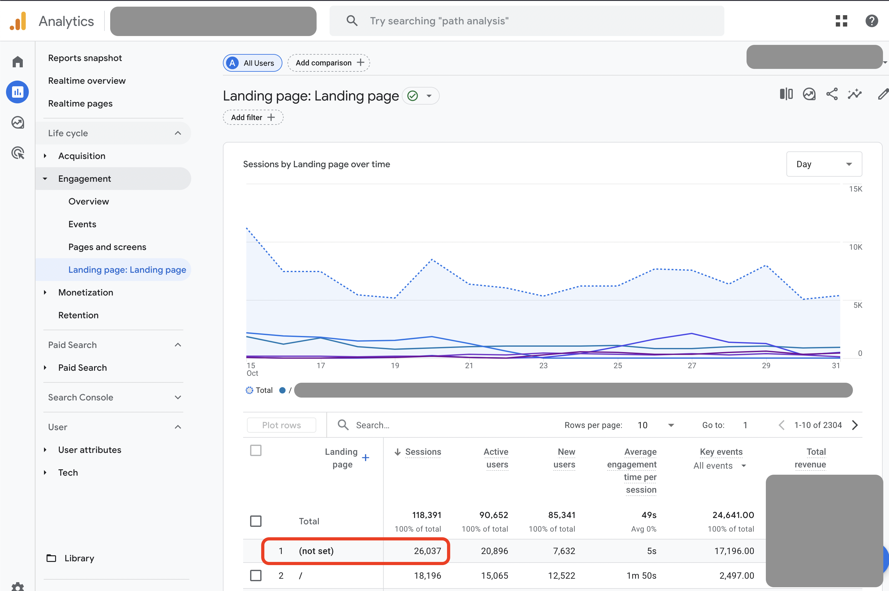
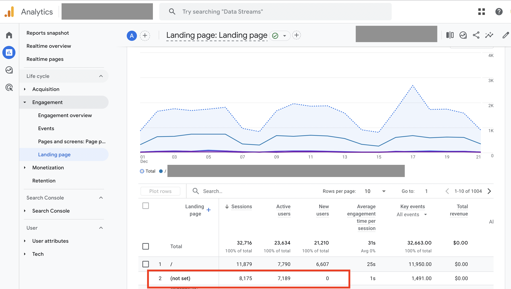
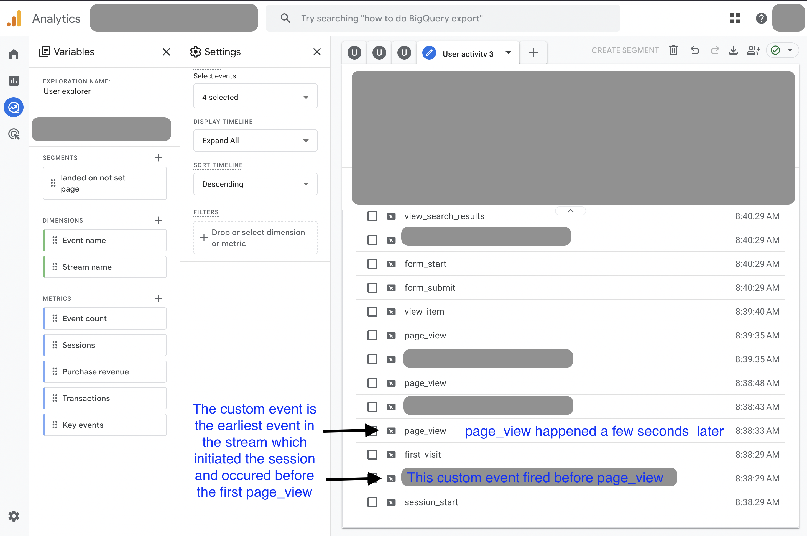

# Google Analytics "(not set)" Landing Pages

I was recently asked to investigate a site where landing page `(not set)` was the top page. <!-- more --> Taking a look at a few random sites I have access to, I could see that `(not set)` landing page always exists, and is often among the top 3 landing pages.

The `(not set)` landing page happens when an event other than a `page_view` initiates a session.

There's no shortage of discussion on this phenomenon online and the conventional response is that it's due to resumed sessions with an event such as a scroll or other event firing before a `page_view`.

This would imply that all sessions landing on the `(not set)` page would be existing users. This was not the case on the screen shot above, but looking at the same drill down (Reports > Engagement > Landing  Pages) on other GA4 properties confirmed this. For example, see that there are no new users here:

Back on the site with `(not set)` landing pages on both existing and new users (very top screen shot). To find the culprit event that was initiating the session before a `page_view`, I created a User Explorer report with a segment where dimension `LandingPage` exactly matches `(not set)`. With the resulting report you can click on any user and review their event history. In each case I saw that the `session_start` event was occurring at the same time as a custom event which happened before `page_view` in the user's event stream.

This was the same for all users in the segment. I've disguised the name of the culprit event here but it was a custom event configured to fire before `page_view` that was causing this to happen.
