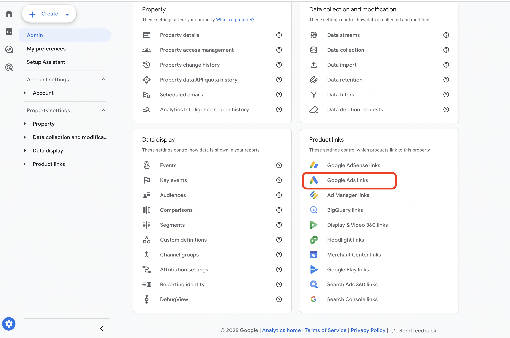
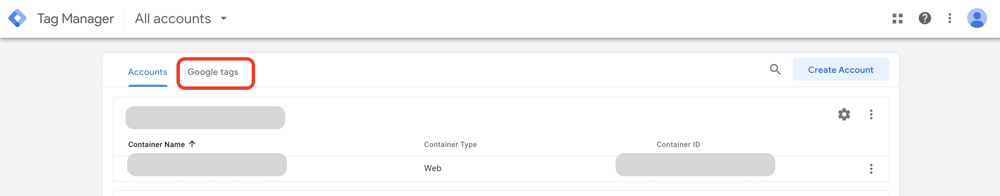
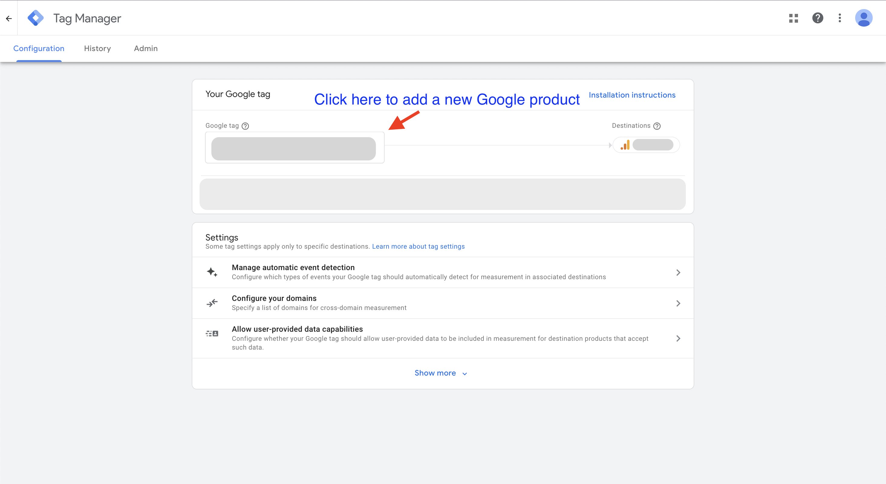
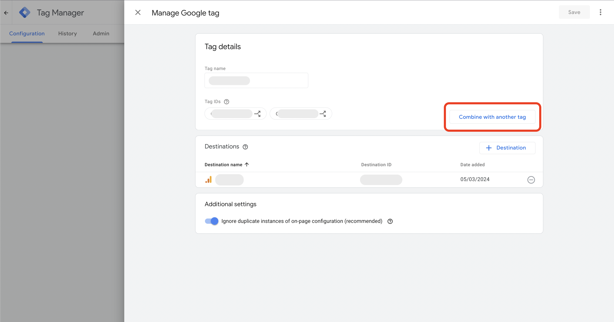
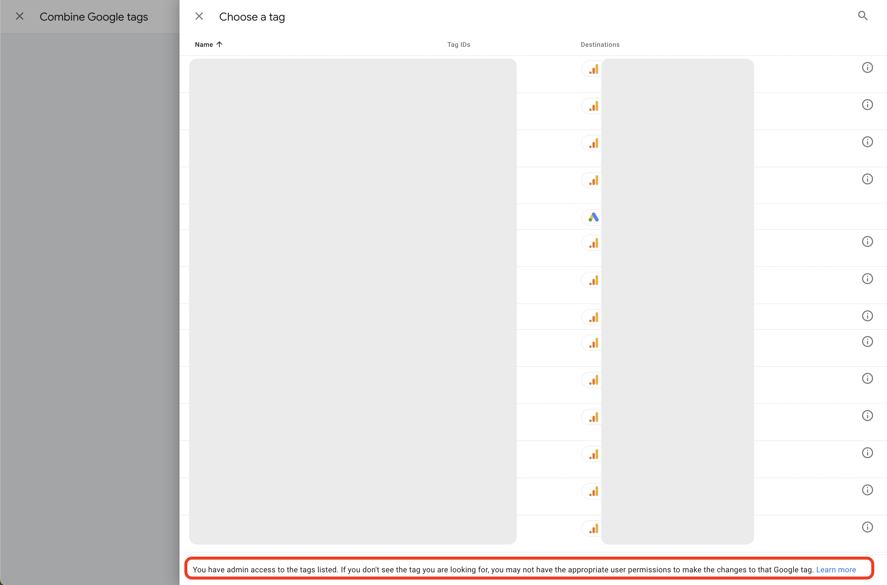
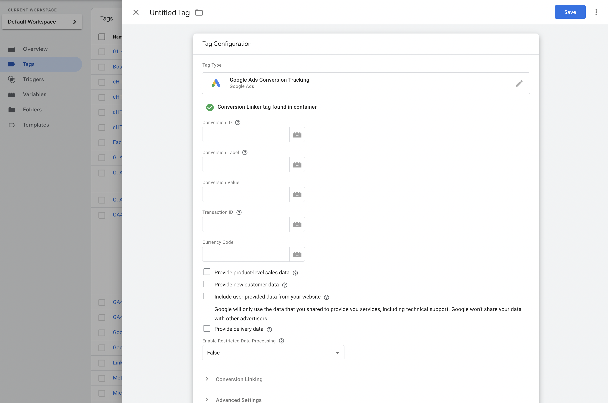

# Share Google Analytics Events with Google Ads

Many GA4 properties I access are also linked to Google Ads. Yet I'm still often asked to add a Google Ads marketing pixel via GTM, even when this link exists. <!-- more -->

There are actually 3 ways that I now know of to share data between Google Analytics and Google Ads.

## Linking Google Analytics with Google Ads

According to [Google's guide to sharing data between GA4 and Google Ads](https://support.google.com/analytics/answer/9379420?hl=en#zippy=%2Cin-this-article), benefits include:

> When you link your Google Analytics property to a Google Ads account, you enable data to flow between products so you can do the following:

- Create Google Ads conversions based on your GA4 key events
- View the performance of your Google Ads conversions
- Re-engage users based on their behavior in your app or on your site

Check if a link already exists by navigating the GA interface, go to Admin > Product Links > Google Ads Links.

Once you open that link you should be able to see any existing Google Ads links, or add one if you have sufficient permissions.

With an active link you can then import any GA4 event as a goal in Google Ads: Goals > Conversions > Summary > Create Conversion Action > Import > Google Analytics 4 > Web. Then select the event that you would like to import.

Following this drill down will lead to a screen showing events that are available to share from GA4.

Sharing an event rather than duplicating tracking across two systems helps by ensuring there's a single source.

However with this approach note that the new goal event won't show up in Google Ads as quickly as with a regular pixel since Google Analytics data usually has a 1-2 day lag. On top of that, importing an event from Analytics to Ads will not make use of conversion windows.

## Adding a Google Ads Property ID to the Google Tag (GTAG)

You can send a Google Tag's event stream to multiple Google platforms just by adding the property ID. [About the Google tag](https://support.google.com/tagmanager/answer/11994839).

> The Google tag (gtag.js) is a single tag you can add to your website that allows you to use a variety of Google products and services. Instead of managing multiple tags for different Google product accounts, you can use the Google tag across your entire website and connect the tag to multiple destinations.

Access Google Tag admin via Tag Manager https://tagmanager.google.com/#/home then click on "Google Tags"

Locate the Google Tag which currently receives your event stream and click through on it, then click the Google Tag box to administer the tag.

Then click "Combine with another Google Tag" to see available tags to link with.

Clicking through on that button will lead to a list of tags that you have admin access to. Note the message at the bottom of the page:

> You have admin access to the tags listed. If you don't see the tag you are looking for, you may not have the appropriate user permissions to make the changes to that Google tag. [Learn more](https://support.google.com/tagmanager/answer/6107011)

On the screen above I have admin access to a Google Ads tag if I wanted to share Google Analytics events with it.

## Add a Google Ads Conversion Tag to the Site

The most common approach is to add a pixel to the site, either directly in the code or via Google-Tag-Manager.

I won't add too much detail here since this is already a well known and common approach. You would generate a new tag within Google Ads and then share it with your analyst or developer to add to the site. The generated tag will include a conversion ID and label which you can use to populate the tag template in Google-Tag-Manager.

Then set the tag to fire on the event you want to track as a conversion. If the event is a purchase you can also include the revenue amount (Conversion Value), transaction ID and currency code.

## Customer Data Platforms

Other tools such as Segment can also be configured to share event data with Google Ads. They use the Google Tag approach mentioned above e.g. [Segment documentation](https://segment.com/docs/connections/destinations/catalog/google-ads-classic/).