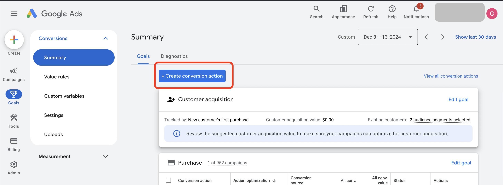
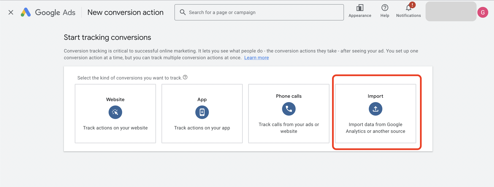

# Share Google Analytics Events with Google Ads

Many GA4 properties I access are also linked to Google Ads. Yet I'm still often asked to add a Google Ads marketing pixel via GTM, even when this link exists. <!-- more -->

According to [Google's guide to sharing data between GA4 and Google Ads](https://support.google.com/analytics/answer/9379420?hl=en#zippy=%2Cin-this-article), benefits include:

> When you link your Google Analytics property to a Google Ads account, you enable data to flow between products so you can do the following:

- Create Google Ads conversions based on your GA4 key events
- View the performance of your Google Ads conversions
- Re-engage users based on their behavior in your app or on your site

## Check If You Already Have a Link

In the GA4 UI go to Admin > Product Links > Google Ads Links.

Once you open that link you should be able to see any existing Google Ads links, or add one if you have sufficient permissions.

With an active link you can then import any GA4 event as a goal in Google Ads: Goals > Conversions > Summary > Create Conversion Action > Import > Google Analytics4 > Web. Then select the event that you would like to import.

Following this drill down will lead to a screen showing events that are available to share from GA4.

## Summary

I'm unsure why it's still so common to have Google Ads pixels set up in addition to the same event in Google Analytics when a link between the two already exists. 

Sharing an event rather than duplicating tracking across two systems helps by ensuring there's a single source.