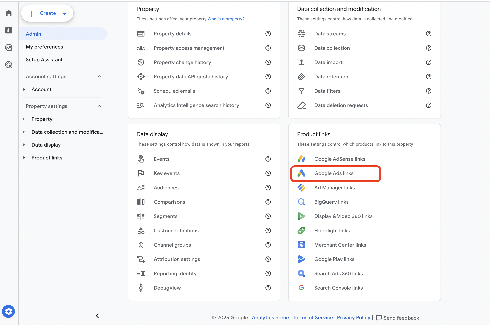
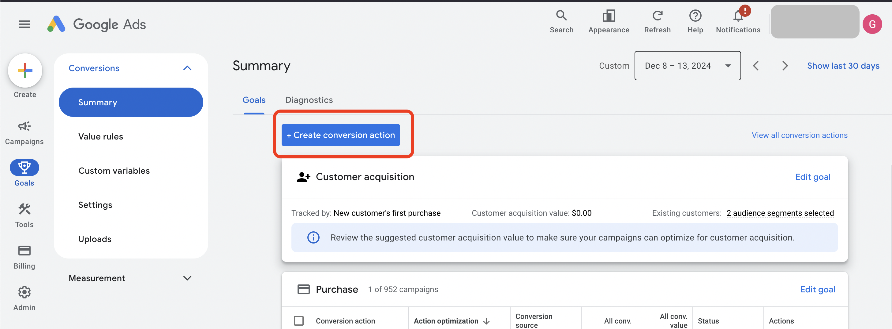
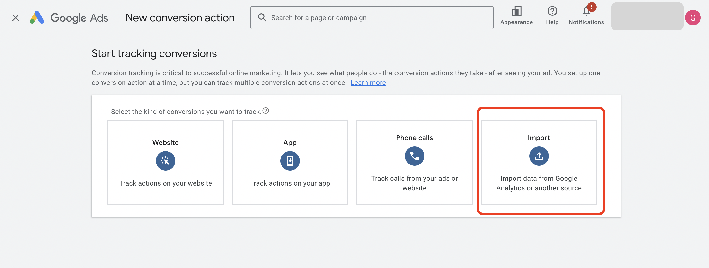
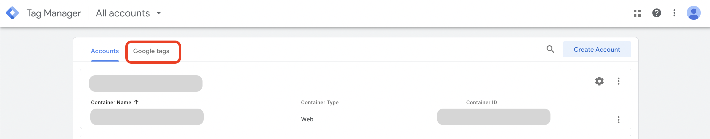
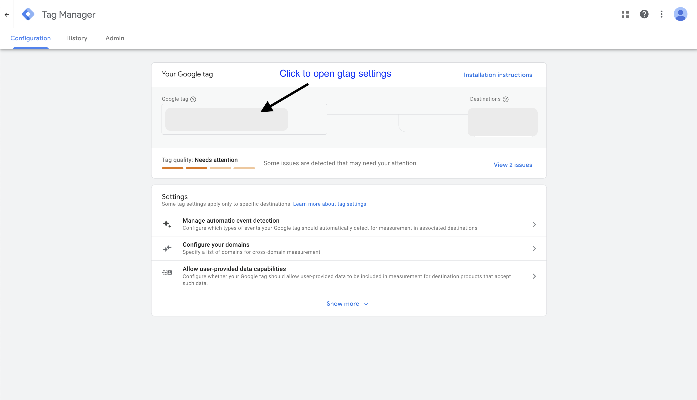
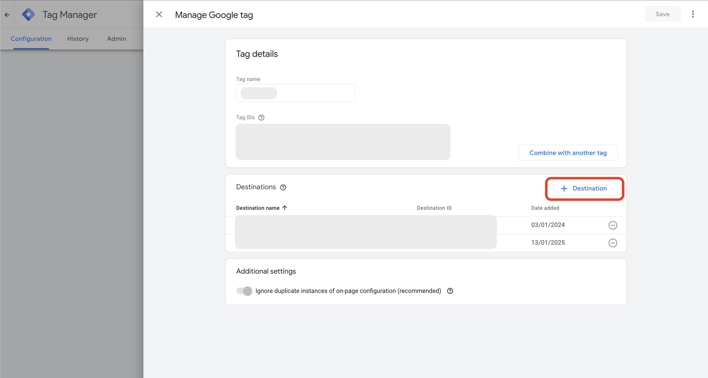
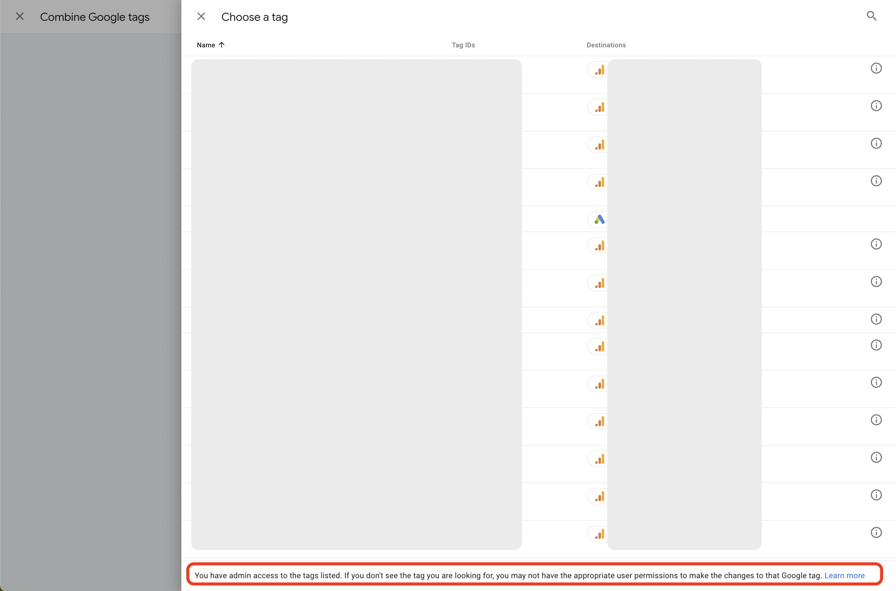
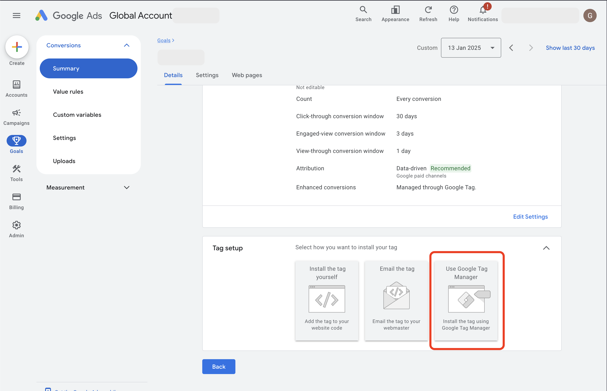
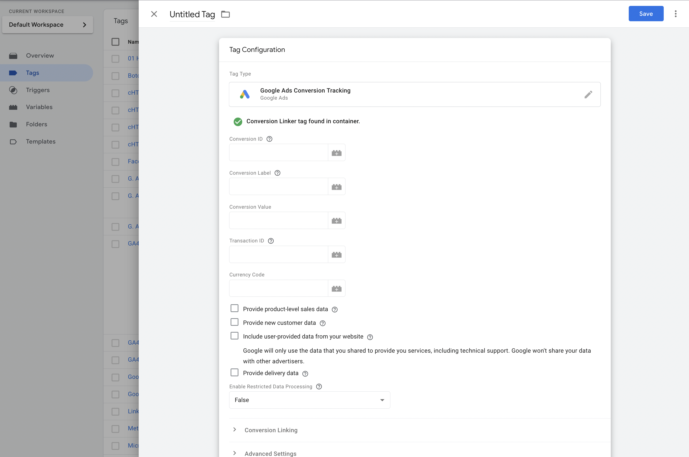

# Share Google Analytics Events with Google Ads

Many GA4 properties I access are also linked to Google Ads. Yet I'm still often asked to add a Google Ads marketing pixel via GTM, even when this link exists. <!-- more -->

There are actually 3 ways that I know of to share data between Google Analytics and Google Ads.

* Linking Google Analytics with Google Ads
* Adding a Google Ads gtag ID as a Destination to the Google Tag
* Add a Google Ads Conversion Tag to the Site via Google Tag Manager

## Linking Google Analytics with Google Ads

According to [Google's guide to sharing data between GA4 and Google Ads](https://support.google.com/analytics/answer/9379420?hl=en#zippy=%2Cin-this-article), benefits include:

> When you link your Google Analytics property to a Google Ads account, you enable data to flow between products so you can do the following:  
>
> * Create Google Ads conversions based on your GA4 key events  
> * View the performance of your Google Ads conversions  
> * Re-engage users based on their behavior in your app or on your site  

Check if a link already exists by navigating to the GA interface: Admin > Product Links > Google Ads Links.

Once you open that link you, should be able to see any existing Google Ads links, or add one if you have sufficient permissions.

With an active link you can then import any GA4 event as a goal in Google Ads: Goals > Conversions > Summary > Create Conversion Action > Import > Google Analytics 4 > Web. Then select the event that you would like to import.

Following this drill down will lead to a screen showing events that are available to share from GA4.

Sharing an event rather than duplicating tracking across two systems helps by ensuring there's a single source of event data.

However, with this approach, the new goal event won't show up in Google Ads as quickly as with a regular Google Tag Manager tag since Google Analytics data usually has a 1-2 day lag. On top of that, importing an event from Analytics to Ads will not make use of conversion windows.

## Adding a Google Ads Gtag ID as a Destination to the Google Tag

[About the Google tag](https://support.google.com/tagmanager/answer/11994839).

> The Google tag (gtag.js) is a single tag you can add to your website that allows you to use a variety of Google products and services. Instead of managing multiple tags for different Google product accounts, you can use the Google tag across your entire website and connect the tag to multiple destinations.

This route makes sense if you have gtag on the page and are not using Google Tag Manager for tracking pageviews and events.

Access Google Tag admin via Tag Manager [https://tagmanager.google.com/#/home](https://tagmanager.google.com/#/home) then click on "Google Tags"

Locate the Google Tag which currently receives your Google Analytics event stream and click through on it, then click the Google Tag box to administer the tag.

Then click "+ Destination" to see available tags to add.

Clicking through on that button will lead to a list of tags that you have admin access to. Note the message at the bottom of the page:

> You have admin access to the tags listed. If you don't see the tag you are looking for, you may not have the appropriate user permissions to make the changes to that Google tag. [Learn more](https://support.google.com/tagmanager/answer/6107011)

To add a Google Ads tag as a destination select from the list of available Google Tags.

## Add a Google Ads Conversion Tag to the Site via Google Tag Manager

The most common approach is to add a Google Ads goal on the site.

I won't add too much detail here since this is already a well known and common approach.

After creating the goal, under tag set up choose 'Google Tag Manager' to obtain the required params. The generated tag will include a conversion ID and label which you can use to populate the tag template in Google Tag Manager.

After clicking, note the conversion ID and label you need to add to Google Tag Manager:

Then set the tag to fire on the event you want to track as a conversion. If the event is a purchase you can also include the revenue amount (Conversion Value), transaction ID and currency code.

## Gotchas

Make sure your gtag consent settings are configured for cookie consent. Consent settings are available at [https://tagmanager.google.com/#/home#tags](https://tagmanager.google.com/#/home#tags), select the correct gtag and click through to settings then select 'Show more' > 'Manage default consent settings for data collection' and select the appropriate option.

In the case of a Google Ads Conversion Tag via GTM, make sure you have a gtag that corresponds to the Google Ads account in question on the site. While recently debugging why a conversion tag was labelled as 'inactive' in the Ads interface, I found that the gtag on the site was for another Ads account. I added the correct gtag id as a destination which got things working.
