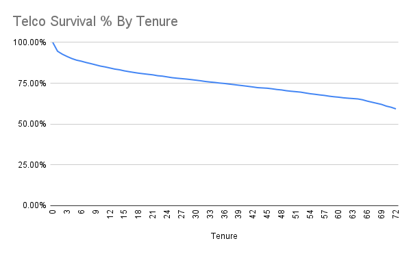
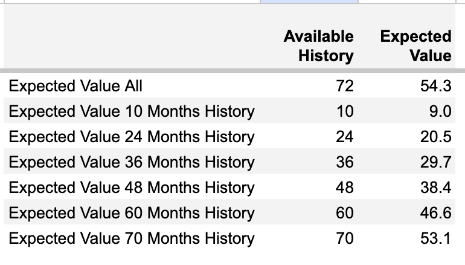
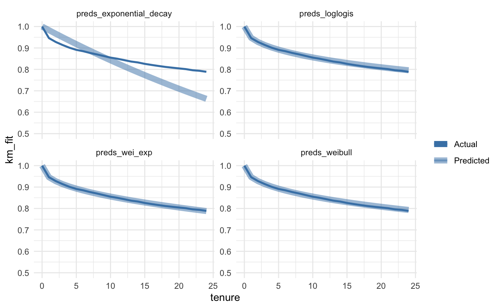
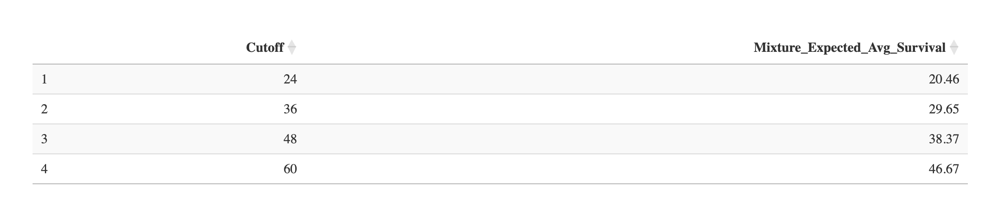

# Subscriber Lifetime Value Modeling

While working on a marketing campaign dashboard that reports Return on Ad Spend (ROAS) at the campaign level, I was asked to include predicted lifetime value (LTV) alongside current 'ROAS to date'. This would make a case for increased spend on ads by justifying higher bids at the margin. <!-- more -->

There are multiple ways to calculate subscriber survival and expected lifetime value. In this example I calculated survival curves, then integrated the best fitting model to get expected value.

## Example Data

One well-known churn dataset is the [IBM Telco Customer Churn Dataset](https://www.kaggle.com/datasets/blastchar/telco-customer-churn), also hosted on Kaggle. 

## Spreadsheet

I downloaded the Telco Churn data into Google Sheets [here](https://docs.google.com/spreadsheets/d/1L5AxjLZdCqSKOZEfRCFpV8iN5eDYxnE7t8sbRvfFRSQ/edit?usp=sharing).

For each tenure, I took the count of churned accounts as the numerator and, for the denominator, accounts with as much or more tenure i.e., if an account is only 3 months old, it is not included in the denominator for survival of tenures of 4 or more months. Here's the resulting survival curve:

This curve is useful if you'd like to know the % probability that an account is still with you after a given number of months, e.g., 10, 20, 30 months gives 85%, 80%, and 77%.

Integrating a survival curve gives you the mean or expected lifetime value, in this case of 54 months.

A drawback of this non-parametric method is that the LTV is determined by how much historic data you have. The table below calculates the estimated value, but having restricted the history to each corresponding bin.

The approach outlined in the spreadsheet is known as Kaplan-Meier, and it's better for understanding survival probability at a given timepoint where history exists within the data rather than providing an overall expected survival value.

Kaplan-Meier is often a first look at survival analysis for a business and is just `churned accounts / accounts that could have churned` for each time period.

## Parametric Models

Unlike Kaplan-Meier, parametric models can extrapolate to predict survival for future, unseen time periods.

To demonstrate this, I cut the Telco data at 12 months and then used the resulting fit to extrapolate out an additional year to 24 months. 

Use cases:
 * New business with less historic data trying to estimate future retention
 * Product AB testing, where you can model expected survival vs. a test group
 * Adjust campaign ad spend based on expected lifetime ROAS of a cohort

### Workflow

The plot below shows actual survival in dark blue, while the lighter blue line is the predicted survival for each parametric model tested.

Since the models were only trained on 12 months of data, everything after 12 months on the light blue curves is extrapolated.

In this case, just eyeballing the plots, the mixture model combining Weibull and Exponential Decay fits actual data out to 24 months a little better than Weibull by itself.

## Expected Survival Time (LTV)

Integrating a survival curve gives the mean expected survival time. Multiply your monthly or annual revenue by this mean survival time to get an LTV estimate for a new subscriber.

Since the parametric curves level off, we need to define a hard cutoff such as 3, 4, or 5 years.

If we only had 24 months of history, integrating the Kaplan-Meier curve would give an expected survival time of 20.5 months (See the table of expected survival probabilities above).

Whereas using the parametric model gives a better, fairer result since it can look beyond the initial 24 months.

These resulting LTV multipliers can be applied to new subscriptions to calculate expected lifetime value.

[Code used for the analysis and plots is here.](https://github.com/digital-analysis-co/dac-post-notebooks/blob/main/subscriber_lifetime_value_retention.Rmd)